<!-- Visuals live in ./assets and follow the browser's light / dark theme.
     Edit scripts/generate-assets.js, then run `npm install && npm run build` to regenerate them. -->

I build the tools other developers use every day, and the platforms they run on. Most of my work sits where .NET, DNN, the browser and IIS / Azure meet: desktop tooling, web modules, APIs and the automation that keeps it all deployed and backed up.

 

 

 

  <picture>
    <source media="(prefers-color-scheme: dark)" srcset="https://github-readme-stats.vercel.app/api?username=Albadit&show_icons=true&rank_icon=github&include_all_commits=true&count_private=true&show=reviews,prs_merged,prs_merged_percentage&card_width=460&border_radius=14&bg_color=151b23&border_color=30363d&title_color=e6edf3&text_color=9198a1&icon_color=e6edf3&ring_color=e6edf3" />
    
  </picture>
  <picture>
    <source media="(prefers-color-scheme: dark)" srcset="https://github-readme-stats.vercel.app/api/top-langs/?username=Albadit&layout=compact&langs_count=10&card_width=460&border_radius=14&bg_color=151b23&border_color=30363d&title_color=e6edf3&text_color=9198a1" />
    
  </picture>

  <picture>
    <source media="(prefers-color-scheme: dark)" srcset="https://streak-stats.demolab.com?user=Albadit&border_radius=14&background=151b23&border=30363d&stroke=30363d&ring=e6edf3&fire=e6edf3&currStreakNum=e6edf3&sideNums=e6edf3&currStreakLabel=e6edf3&sideLabels=9198a1&dates=656c76" />
    
  </picture>

  <picture>
    <source media="(prefers-color-scheme: dark)" srcset="https://raw.githubusercontent.com/Albadit/Albadit/output/github-contribution-grid-snake-dark.svg" />
    
  </picture>

Build things that make development easier.

